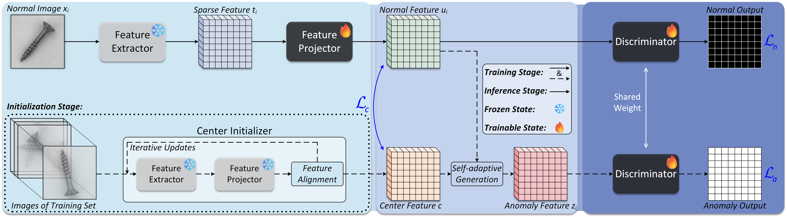

# PBAS

[](https://paperswithcode.com/sota/anomaly-detection-on-mvtec-ad?p=progressive-boundary-guided-anomaly-synthesis)
[](https://paperswithcode.com/sota/anomaly-detection-on-mpdd?p=progressive-boundary-guided-anomaly-synthesis)
[](https://paperswithcode.com/sota/anomaly-detection-on-visa?p=progressive-boundary-guided-anomaly-synthesis)



**Progressive Boundary Guided Anomaly Synthesis for Industrial Anomaly Detection**

_Qiyu Chen, Huiyuan Luo, Han Gao, Chengkan Lv*, Zhengtao Zhang_

[IEEE DOI Link](https://doi.org/10.1109/TCSVT.2024.3479887) & 
[ArXiv Preprint Link](https://arxiv.org/abs/2412.17458)

## Table of Contents
* [📖 Introduction](#introduction)
* [🔧 Environments](#environments)
* [📊 Data Preparation](#data-preparation)
* [🚀 Run Experiments](#run-experiments)
* [🔗 Citation](#citation)
* [🙏 Acknowledgements](#acknowledgements)
* [📜 License](#license)

## Introduction
This repository provides PyTorch-based source code for PBAS,
a framework that enhances unsupervised anomaly detection by directionally synthesizing significant anomalies
without predefined texture properties, guided by a progressive decision boundary.
Here, we present a brief summary of PBAS's performance across several benchmark datasets.

|  PBAS   | MVTec AD | VisA  | MPDD  |
|:-------:|:--------:|:-----:|:-----:|
| I-AUROC |  99.8%   | 97.7% | 97.7% |
| P-AUROC |  98.6%   | 98.6% | 98.8% |

## Environments
Create a new conda environment and install required packages.
```
conda create -n pbas_env python=3.9.15
conda activate pbas_env
pip install -r requirements.txt
```
Experiments were conducted on NVIDIA GeForce RTX 3090 (24GB).
Same GPU and package version are recommended. 

## Data Preparation
The public datasets employed in the paper are listed below.
These dataset folders/files follow its original structure.

- MVTec AD ([Download link](https://www.mvtec.com/company/research/datasets/mvtec-ad/))
- VisA ([Download link](https://github.com/amazon-science/spot-diff/))
- MPDD ([Download link](https://github.com/stepanje/MPDD/))

## Run Experiments
For example, edit `./shell/run-mvtec.sh` to configure arguments `--datapath`, `--classes`, and hyperparameter settings.
Please modify argument `--test` to 'ckpt' / 'test' to toggle between training and test modes.

```
bash run-mvtec.sh
```

## Citation
Please cite the following paper if the code help your project:

```bibtex
@article{chen2024progressive,
  title={Progressive Boundary Guided Anomaly Synthesis for Industrial Anomaly Detection},
  author={Chen, Qiyu and Luo, Huiyuan and Gao, Han and Lv, Chengkan and Zhang, Zhengtao},
  journal={IEEE Transactions on Circuits and Systems for Video Technology},
  year={2025},
  volume={35},
  number={2},
  pages={1193-1208},
}
```

## Acknowledgements
Thanks for the great inspiration from [SimpleNet](https://github.com/DonaldRR/SimpleNet/) and [GLASS](https://github.com/cqylunlun/GLASS/).

## License
The code in this repository is licensed under the [MIT license](https://github.com/cqylunlun/PBAS?tab=MIT-1-ov-file/).
